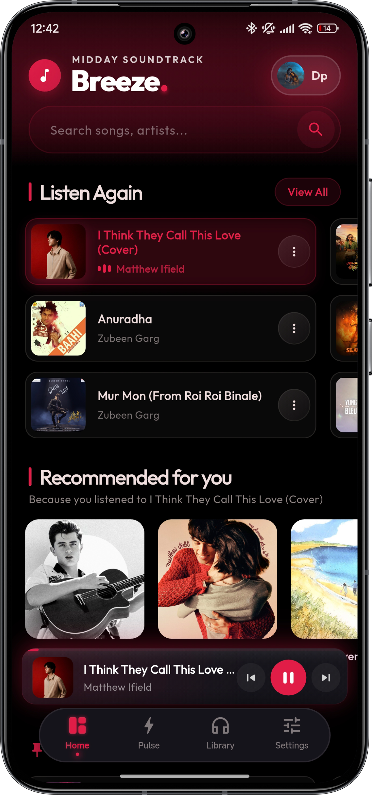
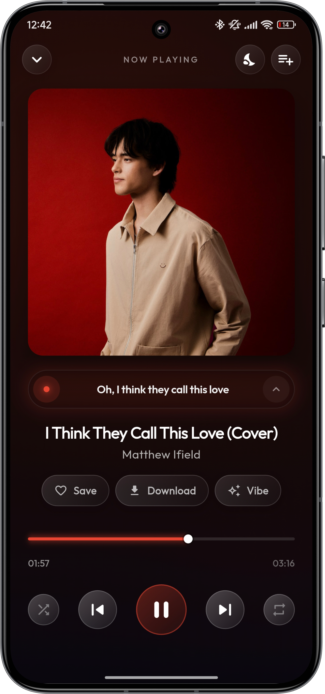
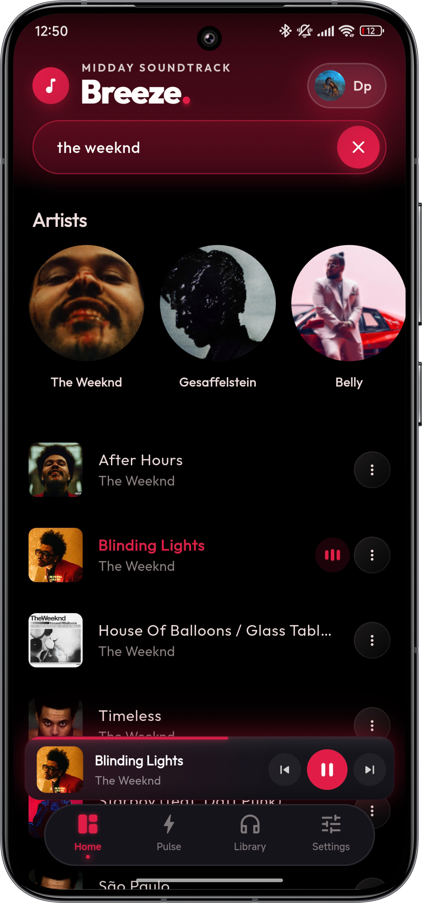
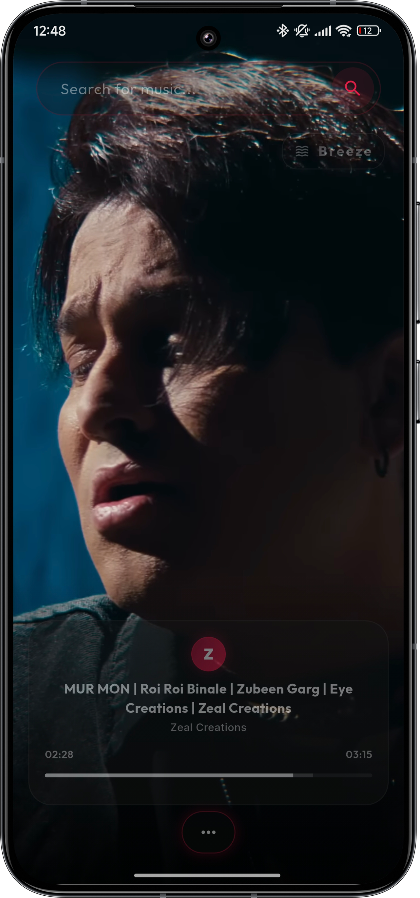
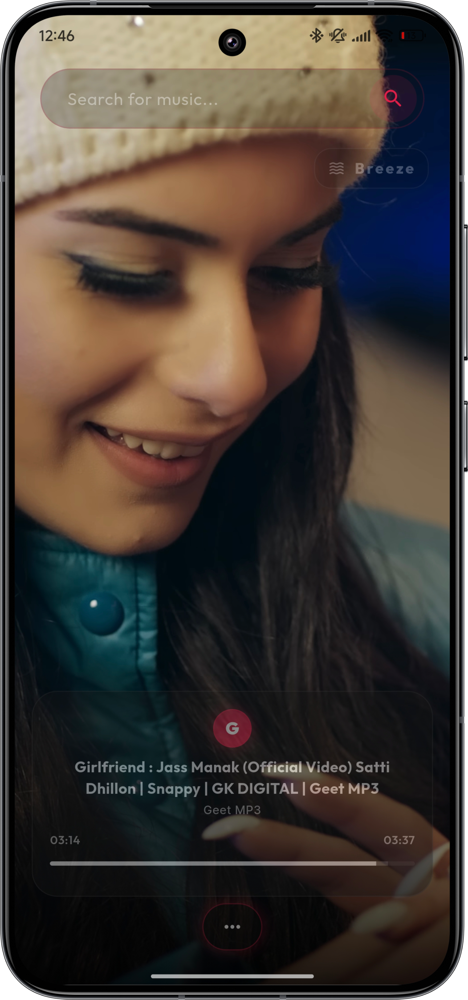
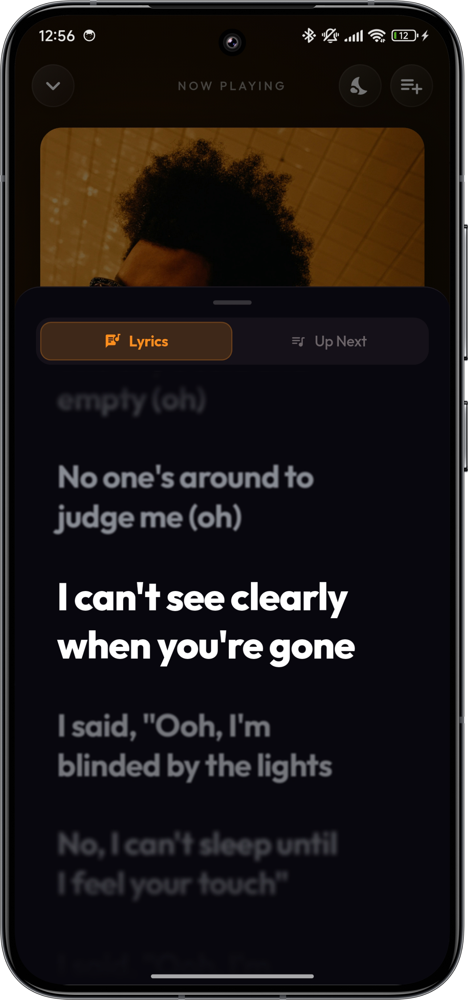
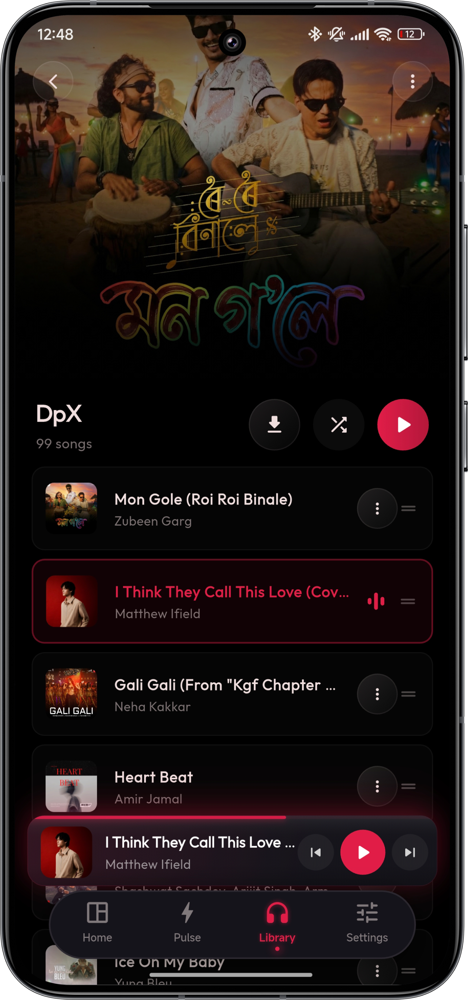
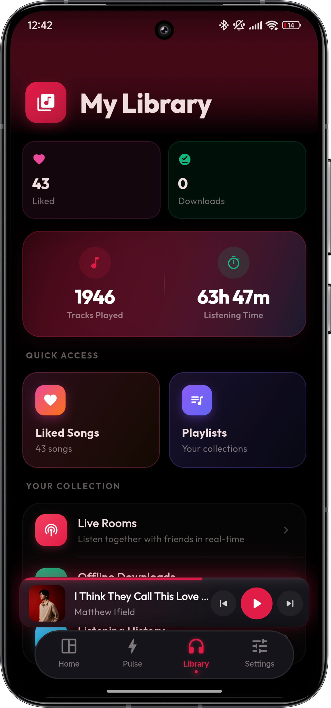
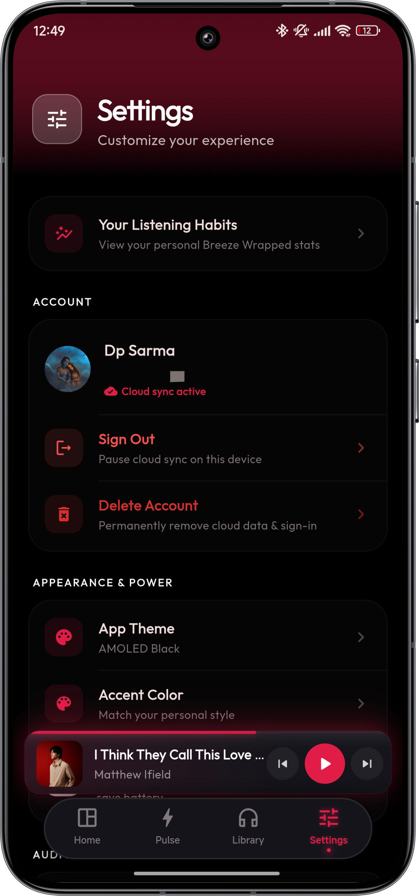

  
  <h1>Breeze Music</h1>
  
<b>A modern, high-performance music client tailored for seamless listening.</b>

  
  
  

---

## Overview

Breeze Music is a beautifully crafted music player designed to provide a premium, uninterrupted listening experience. Built with a focus on deep queue management, rich UI aesthetics, and buttery-smooth performance, it connects directly to extensive music catalogs to deliver high-quality streaming without compromise.

## Features

- **Pulse Tab (Discover):** An endless feed of trending music and fresh recommendations tailored to your taste.
- **Live Sync Rooms:** Listen together! Create a live room and share your music directly with friends in perfect synchronization.
- **Fluid Interface:** A carefully tuned, high-contrast user interface featuring dynamic color extraction, glassmorphism elements, and micro-animations strictly optimized for 120Hz displays.
- **4K Video Playback:** Seamlessly switch between audio and high-resolution 4K music videos without interrupting your flow.
- **Advanced Queue Management:** "Up Next" algorithms automatically generate infinite radio stations based on your current track so the music never stops.
- **Synchronized Lyrics:** View real-time, perfectly synced lyrics that scroll seamlessly alongside your music.
- **YouTube Music Import:** Seamlessly import and migrate your existing YouTube Music playlists directly into your Breeze library.
- **Battery Saver Mode:** Intelligent optimizations allow you to keep listening for hours without draining your phone's battery.
- **Offline Capabilities:** Download your favorite tracks and playlists locally for high-quality offline listening.
- **Cloud Synchronization:** Securely log in with Google to keep your listening history, favorites, and preferences in perfect sync across devices.
- **Custom Audio Pipeline:** Built-in Android equalizer, loudness enhancer, gapless playback support, and robust ExoPlayer auto-recovery.

## Screenshots

<table align="center">
  <tr>
    <td align="center"></td>
    <td align="center"></td>
    <td align="center"></td>
  </tr>
  <tr>
    <td align="center"></td>
    <td align="center"></td>
    <td align="center"></td>
  </tr>
  <tr>
    <td align="center"></td>
    <td align="center"></td>
    <td align="center"></td>
  </tr>
</table>

## Installation

<h3><b><a href="https://github.com/hunterdp11/breeze-releases/releases/download/v1.2.3/app-arm64-v8a-release.apk">Download Latest APK (v1.2.3)</a></b></h3>

You can also browse all available architectures on the [Releases](https://github.com/hunterdp11/breeze-releases/releases) page.

1. Download the `.apk` file directly to your Android device.
2. Open the downloaded file to install. 

*Note: If prompted, ensure you have enabled "Install unknown apps" for your browser or file manager.*

## Acknowledgements

- **[just_audio & audio_service](https://github.com/ryanheise/just_audio)** by ryanheise – The core of our audio engine, handling ExoPlayer, background playback, and media notifications.
- **[Viper Presets](https://github.com/syntaxticsugr/ViPER4Android-Presets)** by syntaxticsugr – Inspiration for our built-in audio tuning configurations.

---

  <i>Developed and maintained by <a href="https://github.com/hunterdp11">hunterdp11</a></i>

