

  
  <h1>Breeze Music</h1>
  
<b>A modern, high-performance music client engineered for Android and Windows.</b>

  

  
  

---

## Overview

Breeze Music is a high-performance, cross-platform audio player crafted for high-fidelity streaming, responsive user interaction, and seamless listening across Android and Windows. Built on top of an advanced audio pipeline, Breeze delivers low-latency playback, real-time synchronized lyrics, robust queue automation, and multi-device cloud synchronization without compromising on aesthetics or system efficiency.

---

## Key Features

### Audio Engine and Playback
- **High-Fidelity Audio Streaming:** Direct access to rich audio catalogs with dynamic bit-rate selection up to 320 kbps.
- **Hardware Sound Processing:** Integrated equalizer profiles, spatial virtualizer, loudness enhancer, and hardware-accelerated sound effects.
- **Zero-Stutter Gapless Playback:** Smooth transitions between queue tracks with automated buffering and network recovery.
- **Synchronized Lyrics:** Time-synced scrolling lyrics with word-by-word highlighting and multilingual transliteration support.
- **Video and Audio Streaming:** Seamless toggle between pure audio streaming and high-resolution video streams without playback interruption.

### Platform Support

#### Android
- Optimized for high-refresh-rate displays (90Hz, 120Hz, 144Hz) with frame-perfect touch responsiveness.
- Background audio service integration with persistent lock screen controls and system notification actions.
- Battery saver optimization and low-overhead memory architecture.

#### Windows
- Native Windows x64 desktop execution with dedicated desktop window controls and fluid adaptive layouts.
- System Media Transport Controls (SMTC) integration for hardware keyboard media keys, volume rocker, and system overlay coordination.
- Desktop-tailored navigation with keyboard shortcuts and wide-screen responsiveness.

### Library and Cloud Integration
- **Cloud Synchronization:** Instant multi-device sync for playlists, liked tracks, custom albums, and listening preferences via Google Cloud.
- **Offline Storage:** Download tracks, albums, and playlists for local, network-independent playback.
- **YouTube Music Import:** Direct playlist import tools to migrate existing libraries seamlessly.
- **Smart Queue and Infinite Radio:** Automated "Up Next" algorithms generating dynamic, infinite radio feeds based on current track analysis.
- **Accent Studio:** Tailored dynamic UI theming, curated color palettes, AMOLED pure dark mode, and sleek glassmorphic surfaces.

---

## Screenshots

<table align="center">
  <tr>
    <td align="center">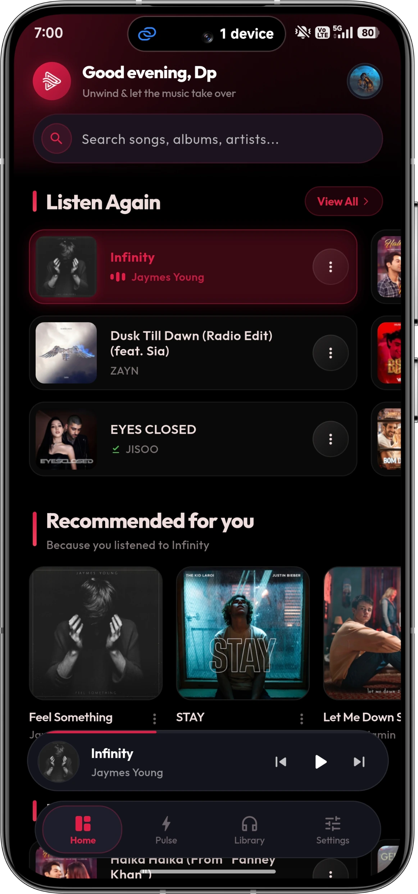</td>
    <td align="center">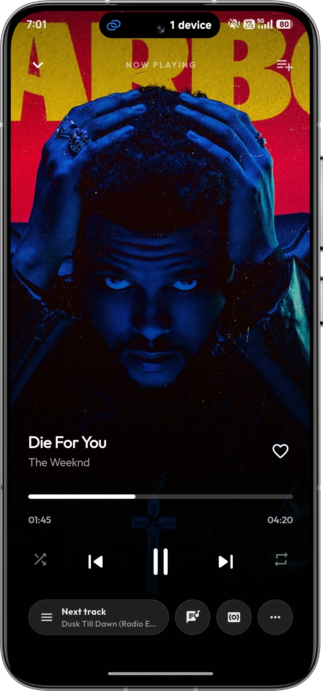</td>
    <td align="center">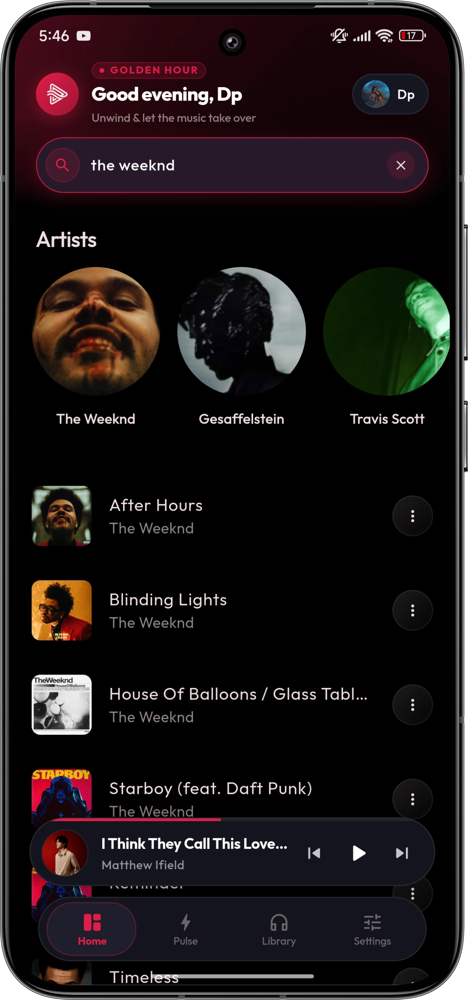</td>
  </tr>
  <tr>
    <td align="center">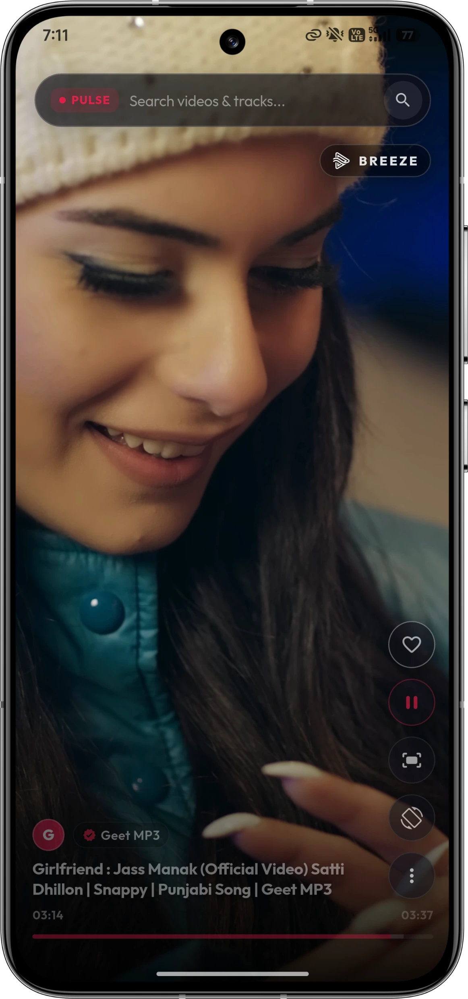</td>
    <td align="center">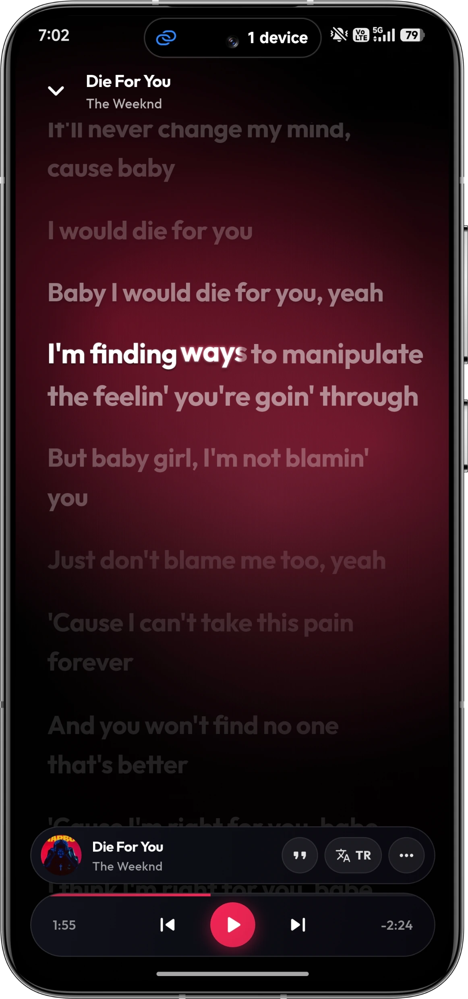</td>
    <td align="center">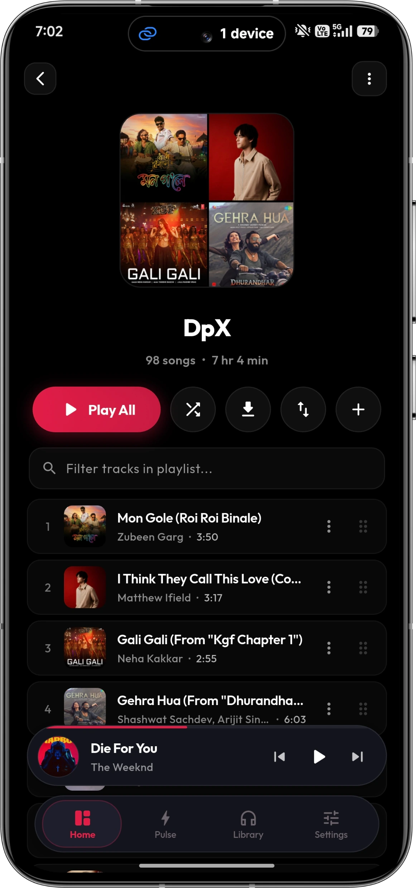</td>
  </tr>
  <tr>
    <td align="center">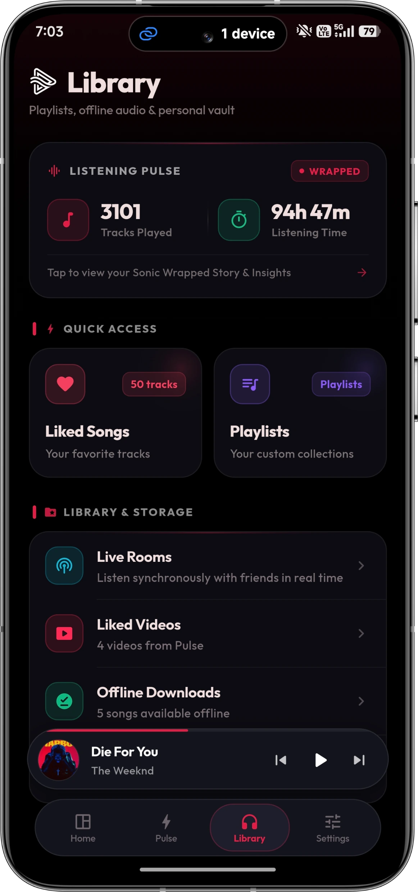</td>
    <td align="center">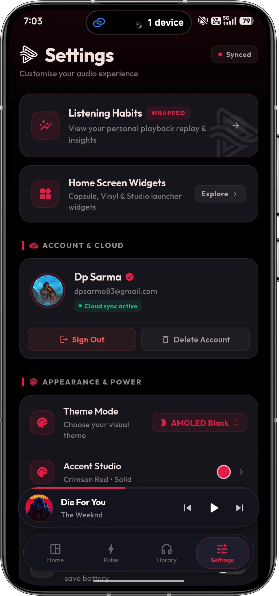</td>
    <td align="center">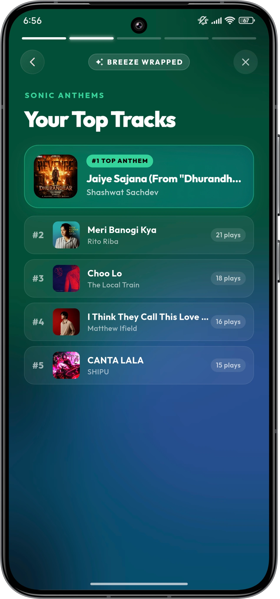</td>
  </tr>
  <tr>
    <td align="center">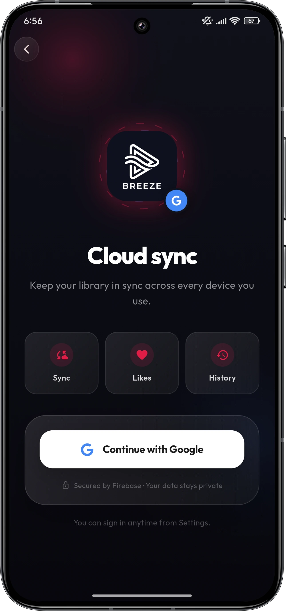</td>
    <td align="center">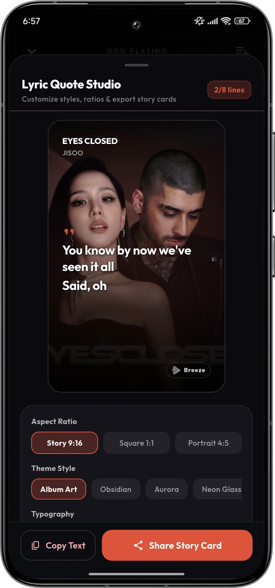</td>
    <td align="center">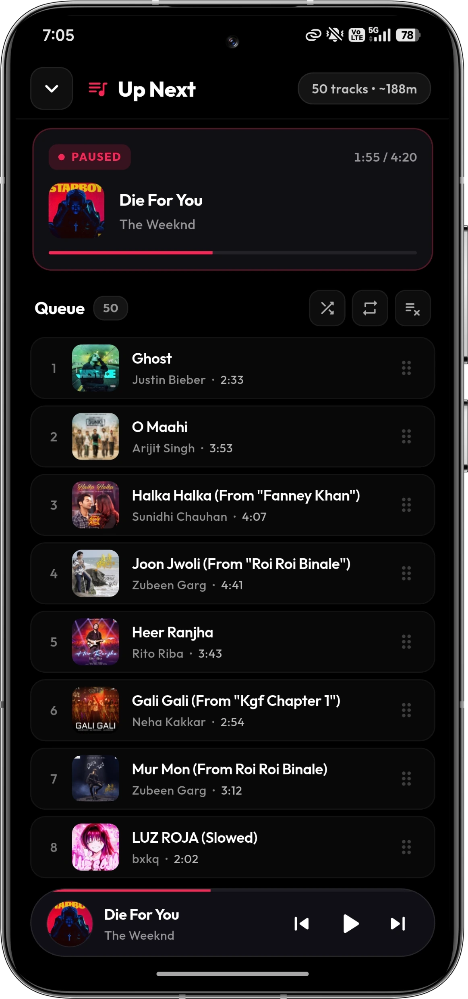</td>
  </tr>
</table>

---

## Installation

### Download v1.2.6

| Platform | Architecture | Download |
|---|---|---|
| Android | arm64-v8a (Recommended, modern 64-bit devices) | [app-arm64-v8a-release.apk](https://github.com/hunterdp11/breeze-releases/releases/download/v1.2.6/app-arm64-v8a-release.apk) |
| Android | armeabi-v7a (Older 32-bit devices) | [app-armeabi-v7a-release.apk](https://github.com/hunterdp11/breeze-releases/releases/download/v1.2.6/app-armeabi-v7a-release.apk) |
| Android | x86_64 (Emulators and x86 tablets) | [app-x86_64-release.apk](https://github.com/hunterdp11/breeze-releases/releases/download/v1.2.6/app-x86_64-release.apk) |
| Windows | x64 Setup Installer | [Breeze_Setup_v1.2.6.exe](https://github.com/hunterdp11/breeze-releases/releases/download/v1.2.6-windows/Breeze_Setup_v1.2.6.exe) |

### Android
1. Download the `.apk` appropriate for your device architecture (arm64-v8a for most modern phones).
2. Open the downloaded file to install. If prompted, allow installation from your browser or file manager.

### Windows
1. Download `Breeze_Setup_v1.2.6.exe` from the table above.
2. Run the installer to complete setup on Windows 10/11.

---

## Architecture and Acknowledgements

- **[just_audio & audio_service](https://github.com/ryanheise/just_audio)** by ryanheise – Robust audio session orchestration, platform channels, background service management, and media notification handling.
- **[Flutter](https://flutter.dev)** – High-performance cross-platform rendering engine powering Android and Windows interfaces.
- **[ViPER Presets](https://github.com/syntaxticsugr/ViPER4Android-Presets)** – DSP reference parameters for hardware sound styling and spatial acoustics.

---

  <i>Developed and maintained by <a href="https://github.com/hunterdp11">hunterdp11</a></i>

